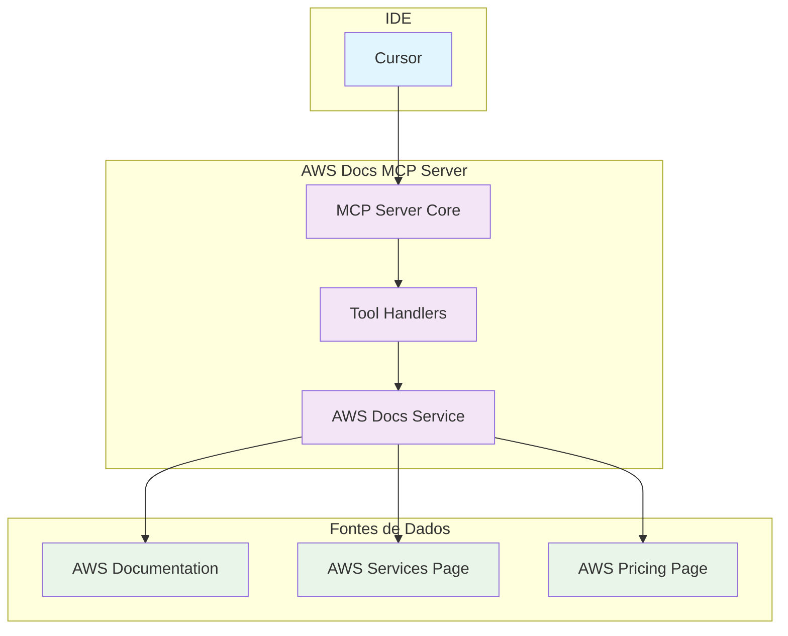
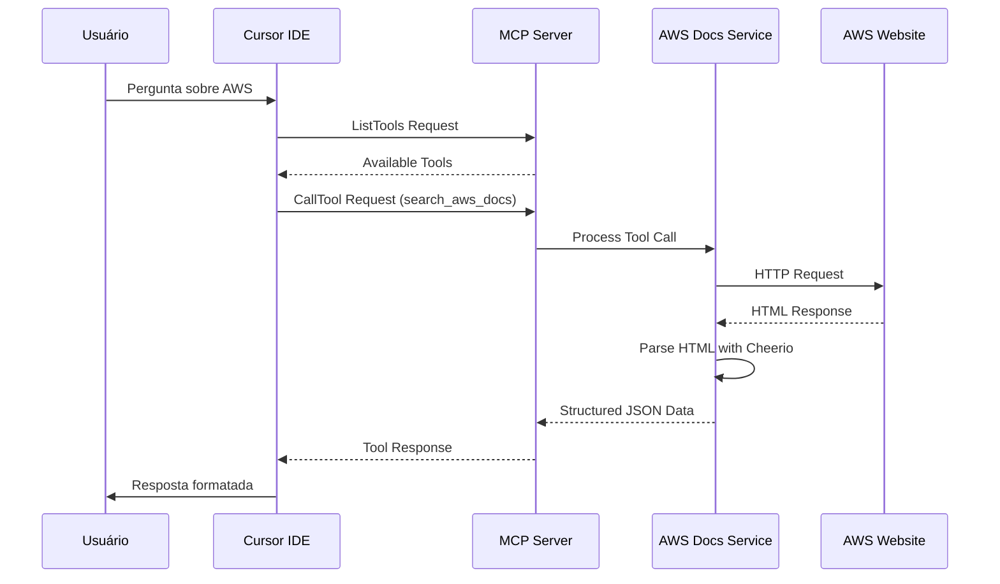
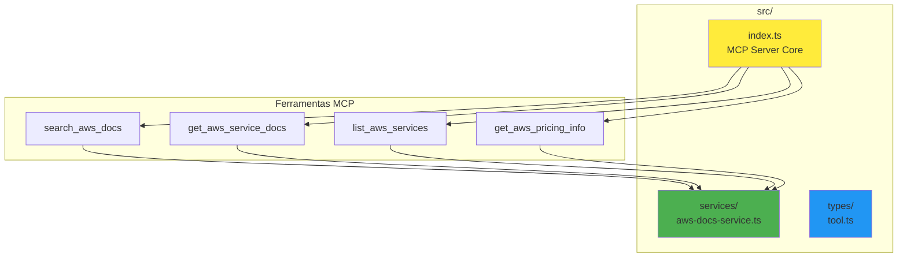
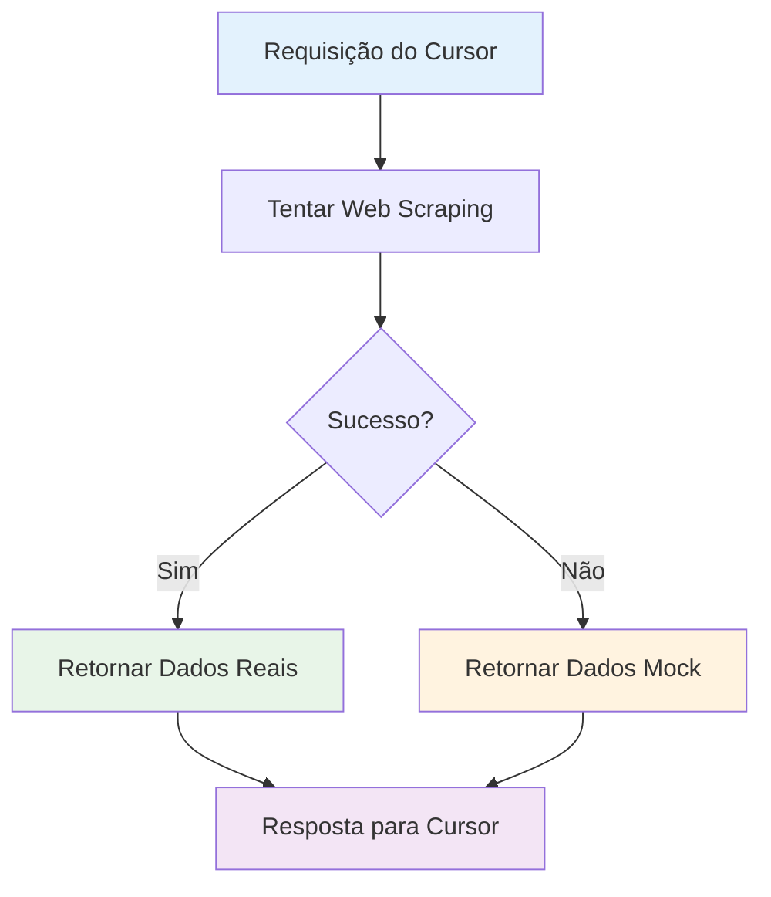

# Diagramas da Arquitetura - AWS Docs MCP Server

## Diagrama de Arquitetura Geral

```mermaid
graph TB
    subgraph "IDE"
        A[Cursor]
    end
    
    subgraph "AWS Docs MCP Server"
        C[MCP Server Core]
        D[Tool Handlers]
        E[AWS Docs Service]
    end
    
    subgraph "Fontes de Dados"
        F[AWS Documentation]
        G[AWS Services Page]
        H[AWS Pricing Page]
    end
    
    A --> C
    C --> D
    D --> E
    E --> F
    E --> G
    E --> H
    
    style A fill:#e1f5fe
    style C fill:#f3e5f5
    style D fill:#f3e5f5
    style E fill:#f3e5f5
    style F fill:#e8f5e8
    style G fill:#e8f5e8
    style H fill:#e8f5e8
```

## Fluxo de Requisição Cursor + MCP

```mermaid
sequenceDiagram
    participant User as Usuário
    participant Cursor as Cursor IDE
    participant MCP as MCP Server
    participant AWS as AWS Docs Service
    participant Web as AWS Website
    
    User->>Cursor: Pergunta sobre AWS
    Cursor->>MCP: ListTools Request
    MCP-->>Cursor: Available Tools
    
    Cursor->>MCP: CallTool Request (search_aws_docs)
    MCP->>AWS: Process Tool Call
    AWS->>Web: HTTP Request
    Web-->>AWS: HTML Response
    AWS->>AWS: Parse HTML with Cheerio
    AWS-->>MCP: Structured JSON Data
    MCP-->>Cursor: Tool Response
    Cursor->>User: Resposta formatada
```

## Estrutura de Componentes

```mermaid
graph TD
    subgraph "src/"
        A[index.ts<br/>MCP Server Core]
        B[services/<br/>aws-docs-service.ts]
        C[types/<br/>tool.ts]
    end
    
    subgraph "Ferramentas MCP"
        D[search_aws_docs]
        E[get_aws_service_docs]
        F[list_aws_services]
        G[get_aws_pricing_info]
    end
    
    A --> D
    A --> E
    A --> F
    A --> G
    
    D --> B
    E --> B
    F --> B
    G --> B
    
    style A fill:#ffeb3b
    style B fill:#4caf50
    style C fill:#2196f3
```

## Estratégia de Fallback

```mermaid
graph TD
    A[Requisição do Cursor] --> B[Tentar Web Scraping]
    B --> C{Sucesso?}
    
    C -->|Sim| D[Retornar Dados Reais]
    C -->|Não| E[Retornar Dados Mock]
    
    D --> F[Resposta para Cursor]
    E --> F
    
    style A fill:#e3f2fd
    style D fill:#e8f5e8
    style E fill:#fff3e0
    style F fill:#f3e5f5
```
