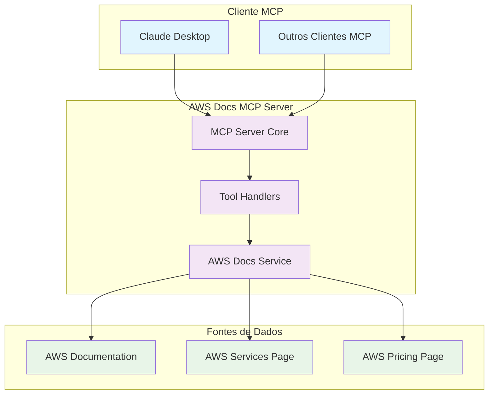
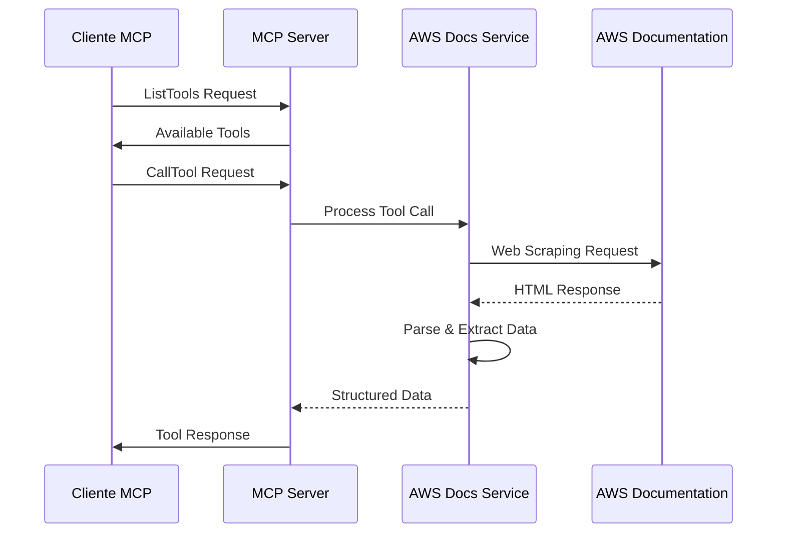
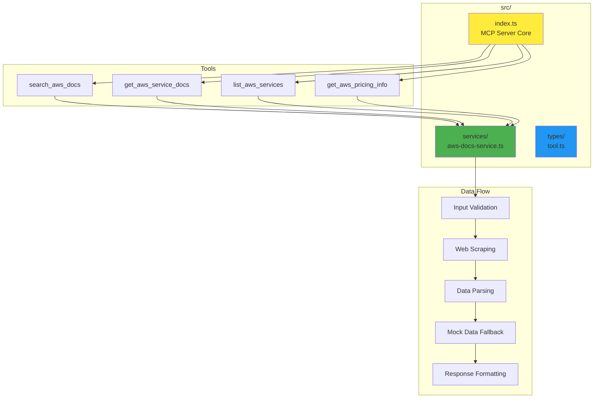
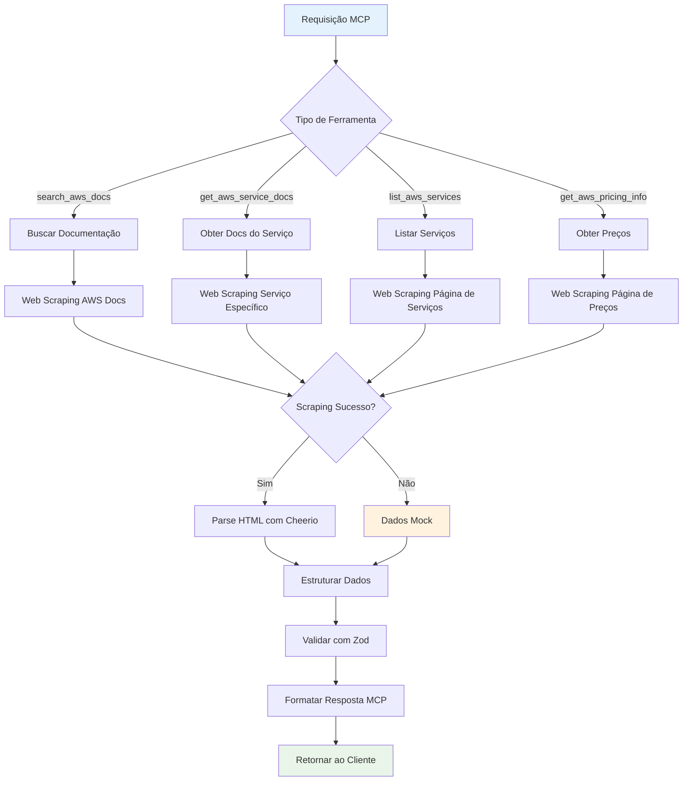
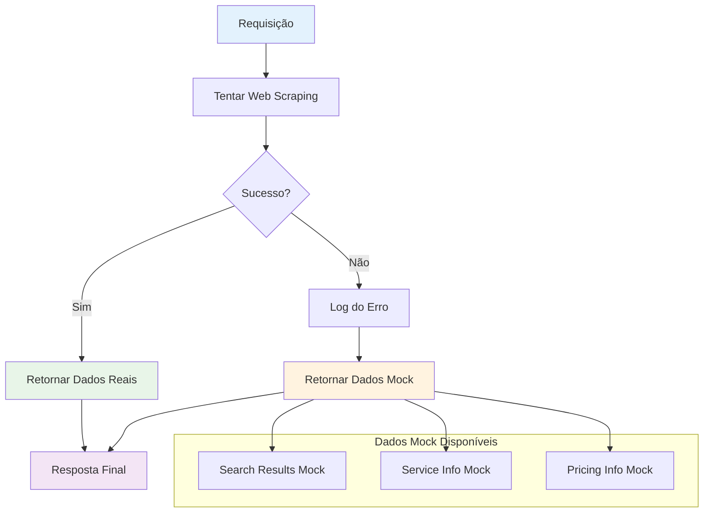
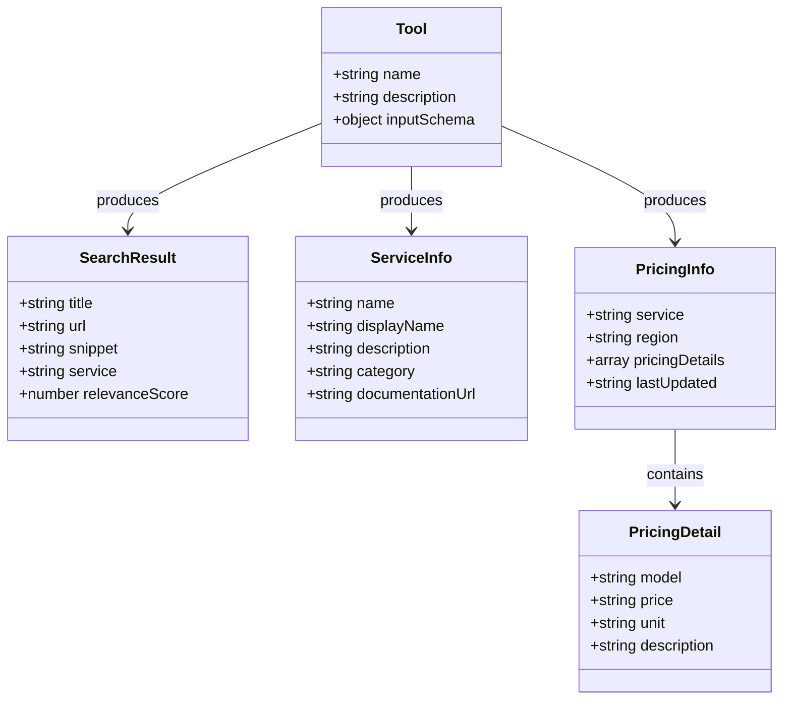
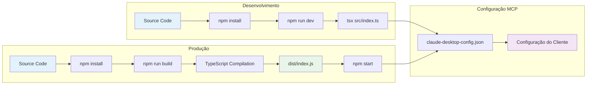

# Diagramas da Arquitetura - AWS Docs MCP Server

## Diagrama de Arquitetura Geral

## Fluxo de Comunicação MCP

## Estrutura de Componentes

## Fluxo de Processamento de Ferramentas

## Estratégia de Fallback

## Estrutura de Dados

## Configuração de Deploy

