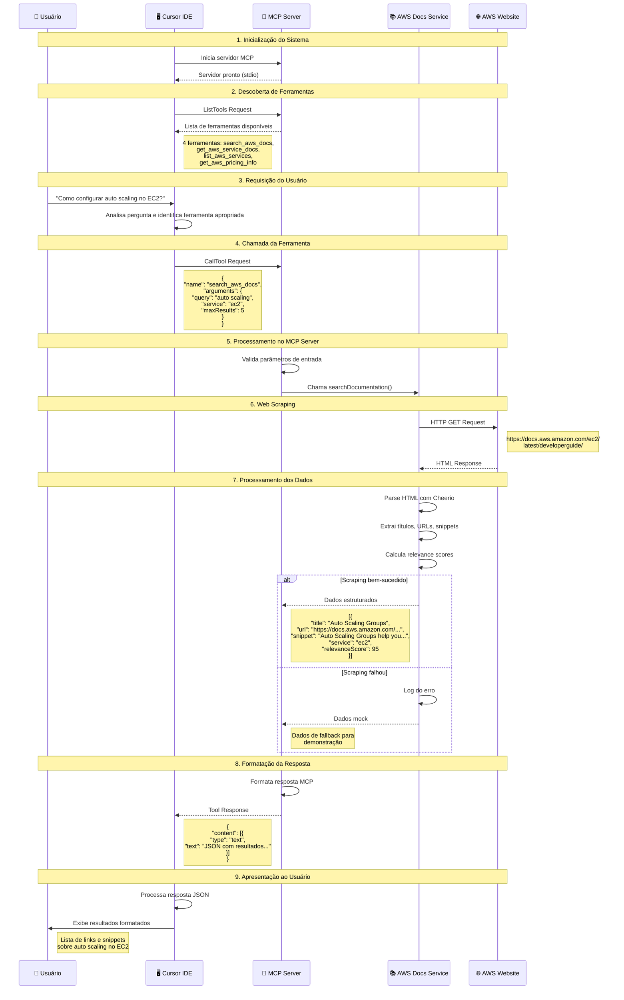

# Fluxo de Requisição Cursor + MCP AWS Docs

## Diagrama de Sequência Detalhado

Este diagrama mostra como funciona uma requisição completa do usuário no Cursor até a resposta com dados da AWS.



## Exemplo de Requisição Real

### Entrada do Usuário
```
"Preciso saber como configurar auto scaling no EC2. Pode me ajudar?"
```

### Processamento Interno
1. **Cursor** identifica que precisa de informações sobre AWS EC2
2. **Cursor** escolhe a ferramenta `search_aws_docs`
3. **MCP Server** recebe a requisição com parâmetros:
   ```json
   {
     "name": "search_aws_docs",
     "arguments": {
       "query": "auto scaling",
       "service": "ec2",
       "maxResults": 5
     }
   }
   ```

### Resposta Estruturada
```json
{
  "content": [
    {
      "type": "text",
      "text": "[\n  {\n    \"title\": \"Auto Scaling Groups\",\n    \"url\": \"https://docs.aws.amazon.com/ec2/latest/developerguide/auto-scaling-groups.html\",\n    \"snippet\": \"Auto Scaling Groups help you maintain application availability and allow you to scale your Amazon EC2 capacity up or down automatically according to conditions you define.\",\n    \"service\": \"ec2\",\n    \"relevanceScore\": 95\n  },\n  {\n    \"title\": \"Getting Started with Auto Scaling\",\n    \"url\": \"https://docs.aws.amazon.com/ec2/latest/developerguide/getting-started-with-auto-scaling.html\",\n    \"snippet\": \"This guide helps you get started with Auto Scaling by creating your first Auto Scaling group.\",\n    \"service\": \"ec2\",\n    \"relevanceScore\": 90\n  }\n]"
    }
  ]
}
```

### Apresentação Final
O Cursor formata e apresenta os resultados de forma amigável ao usuário, incluindo links clicáveis e snippets informativos.

## Vantagens desta Arquitetura

1. **Integração Transparente**: O usuário não precisa saber que está usando MCP
2. **Dados Atualizados**: Web scraping garante informações recentes da AWS
3. **Fallback Robusto**: Dados mock garantem funcionamento mesmo com falhas
4. **Resposta Rápida**: Processamento otimizado e timeout controlado
5. **Formato Estruturado**: Dados JSON facilitam processamento pelo Cursor
